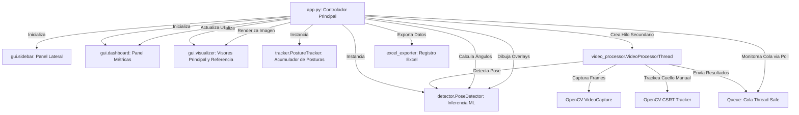

# Sistema de Análisis de Flexión de Tronco y Cuello

Este es un sistema de escritorio interactivo diseñado para medir los ángulos de flexión de tronco, cuello y cabeza en tiempo real a partir de imágenes estáticas y grabaciones de video, utilizando la tecnología de estimación de pose de **MediaPipe**. 

El software cuenta con una interfaz gráfica moderna, totalmente responsiva y adaptada a resoluciones de alta densidad (DPI), facilitando el registro clínico de los segmentos evaluados en planillas Excel.

---

## 1. Arquitectura General y Flujo de Datos

El sistema está diseñado bajo una arquitectura inspirada en **Modelo-Vista-Controlador (MVC)**, adaptada para procesamiento de video en tiempo real sin congelar la interfaz gráfica de usuario (GUI).



### Principios Clave de Diseño:
1. **Procesamiento Concurrente:** La lectura de frames, el seguimiento del cuello manual y la inferencia de MediaPipe se ejecutan en un **hilo secundario** (`VideoProcessorThread`). Esto evita que la interfaz gráfica principal se congele.
2. **Comunicación mediante Cola (Queue):** Se utiliza una cola con límite de tamaño (`queue.Queue`) para pasar los frames procesados desde el hilo de video al hilo principal de forma segura (Thread-Safe).
3. **Escalado Responsivo de Coordenadas:** Los clics en pantalla se traducen proporcionalmente de la resolución lógica de la GUI a las dimensiones reales de la imagen original en alta definición.

---

## 2. Sustentación Detallada de Cada Archivo

### A. [app.py](app.py) (Controlador de la Aplicación)
Es el núcleo central del proyecto. Hereda de `customtkinter.CTk` y actúa como el **Controlador**.
* **Responsabilidades:**
  * Inicializar y configurar el tema estético oscuro de la ventana.
  * Instanciar los frames GUI ([gui/sidebar.py](gui/sidebar.py), [gui/dashboard.py](gui/dashboard.py), [gui/visualizer.py](gui/visualizer.py)).
  * Gestionar los eventos del ratón (`Button-1`) en los visores para registrar las coordenadas de la base del cuello manual (tanto en la imagen principal como en la de referencia).
  * Controlar el inicio, pausa y parada del hilo de video.
  * Realizar el método `poll_results` que se ejecuta recursivamente cada 15 ms mediante `.after()` de Tkinter, extrayendo frames de la cola y actualizando los widgets en tiempo real.
  * Coordinar el llamado a la exportación de Excel pasando las variables de sesión acumuladas (`tracker.frames_data`, `alfa`, `beta`).

---

### B. [detector.py](detector.py) (Inferencia de Pose y Biomecánica)
Módulo encargado de la detección de puntos clave del cuerpo y de los cálculos matemáticos/trigonométricos asociados.
* **Componentes y Clases:**
  * **`PoseDetector`**: Clase contenedora del modelo de Google **MediaPipe Pose Landmarker Lite**. Configurada en modo `IMAGE` para permitir la inferencia asíncrona controlada por frame. Descarga automáticamente el archivo `.task` si no se encuentra localmente.
  * **`obtener_landmarks_analisis`**: Filtra y extrae las coordenadas escaladas en píxeles para la cadera, hombro, oreja, codo y ojo. Soporta selección de lado `Izquierdo`, `Derecho` o `Auto` (eligiendo el lado con mayor visibilidad o confianza de MediaPipe).
* **Fórmulas de Cálculo Biomecánico:**
  * **`calcular_flexion_tronco`**: Calcula el ángulo entre la vertical que pasa por la cadera ($[0, -1]$) y el vector que va desde la cadera hasta la base del cuello manual.
    $$\text{Vector Tronco} = \vec{T} = P_{\text{cuello}} - P_{\text{cadera}}$$
    $$\theta = \arccos\left(\frac{\vec{T} \cdot \vec{V}}{\|\vec{T}\| \|\vec{V}\|}\right) \times \frac{180}{\pi}$$
  * **`calcular_angulo_cabeza`**: Calcula el ángulo de inclinación de la cabeza tomando el vector que une la oreja con el ojo y comparándolo contra la vertical que pasa por la oreja.
    $$\text{Vector Cabeza} = \vec{C} = P_{\text{ojo}} - P_{\text{oreja}}$$
  * **`calcular_flexion_hombro`**: Determina el ángulo en el hombro formado entre el vector hombro-cadera y el vector hombro-codo.
  * **`dibujar_analisis_completo`**: Genera los gráficos vectoriales de OpenCV sobre el frame. Dibuja los círculos en las articulaciones, los vectores de inclinación, los arcos sombreados (con transparencia `addWeighted`) y los textos que muestran el valor numérico del ángulo.
    * **Mejora:** El círculo indicador de la **cadera** se dibuja automáticamente apenas se detecta la pose, sirviendo de guía visual antes de realizar el clic de selección del cuello.

---

### C. [tracker.py](tracker.py) (Seguimiento de la Sesión y Tiempos)
Gestiona la lógica de persistencia temporal del análisis del paciente.
* **Responsabilidades:**
  * Almacenar cronológicamente en la lista `frames_data` los diccionarios con el estado biomecánico de cada frame analizado.
  * Calcular el tiempo activo acumulado de una misma postura. Si los ángulos del frame actual coinciden con los del frame anterior (tras redondeo), incrementa el contador de frames y calcula la duración basándose en los FPS (`frames / FPS`). Si hay un cambio significativo en la postura, el contador se reinicia.

---

### D. [video_processor.py](video_processor.py) (Hilo de Procesamiento Multitarea)
Clase `VideoProcessorThread` que hereda de `threading.Thread`.
* **Responsabilidades:**
  * Leer los frames secuencialmente de un archivo de video mediante `cv2.VideoCapture`.
  * **Algoritmo CSRT de OpenCV:** Si hay un punto manual de cuello definido, inicializa un tracker de correlación espacial discriminativo (**CSRT**) en una caja delimitadora pequeña ($30\times30$ píxeles) centrada en dicho punto. En los siguientes frames, actualiza la caja del cuello automáticamente siguiendo el movimiento físico del paciente. Si el tracker falla, marca el seguimiento como perdido (`tracking_lost = True`).
  * Ejecutar la inferencia del detector MediaPipe sobre el frame actual para extraer los landmarks corporales.
  * Insertar de manera segura el frame y los metadatos en la cola para que la GUI los lea.
  * Controlar la velocidad de reproducción mediante retardos (`time.sleep`) calculados según los FPS del video original.

---

### E. [excel_exporter.py](excel_exporter.py) (Generación de Reportes Estructurados)
Contiene la función `registrar_posturas_excel`.
* **Responsabilidades:**
  * Crear o cargar un libro de Excel usando la librería `openpyxl`.
  * Configurar y forzar el diseño de cabeceras en la hoja "Registro Posturas".
  * **Cálculos Ajustados Independientes:**
    * Resta el ángulo de referencia del tronco ($\alpha$) del ángulo del tronco del video para obtener el **Ángulo del tronco ajustado**.
    * Resta el ángulo de referencia de la cabeza ($\beta$) del ángulo de la cabeza del video para obtener el **Ángulo de la cabeza ajustado**.
    * Calcula el **Ángulo del cuello ajustado** restando el tronco ajustado de la cabeza ajustada.
    * **Robustez:** Si alguno de los valores de referencia o del video no está disponible, calcula los que sí lo estén de manera independiente en lugar de invalidar toda la fila.
  * **Formato Visual Personalizado (Columnas E, H, I, J):**
    * Aplica un relleno de celda de color **azul oscuro/verde petróleo (`#215967`)** y texto en negrita blanco para las cabeceras y datos de las columnas E (5), H (8), I (9) y J (10), facilitando su rápida lectura y presentación formal.

---

## 3. Componentes de Interfaz Gráfica (Carpeta `gui/`)

* **[gui/sidebar.py](gui/sidebar.py)**: Diseña el panel de control izquierdo. Agrupa widgets de entrada: botones de carga de archivos (principal y de referencia), selector de lado del cuerpo (Auto, Izquierdo, Derecho), menús desplegables para elegir colores personalizados de dibujo, barra deslizante para configurar el umbral de confianza del modelo de pose, entrada de texto para el nombre del paciente y botones de reproducción.
* **[gui/dashboard.py](gui/dashboard.py)**: Diseña el panel inferior. Contiene 6 tarjetas informativas: Ángulo del Tronco, Ángulo de la Cabeza, Ángulo del Cuello, Ángulo del Brazo, Lado Leído y Tiempo de la Postura Activa. Posee lógica cromática reactiva en base a rangos biomecánicos de alerta (Verde Neón para rangos seguros, Naranja para nivel medio, Rojo Coral para flexión excesiva).
* **[gui/visualizer.py](gui/visualizer.py)**: Contiene la clase `VisualizerFrame`. Utiliza la librería **PIL (Pillow)** para convertir los arrays de OpenCV en imágenes compatibles con CustomTkinter. Implementa una lógica responsiva para recalcular el tamaño óptimo de visualización manteniendo la relación de aspecto original del video. Traduce de manera precisa las coordenadas físicas del evento de clic a las coordenadas de píxeles reales de la imagen fuente en HD.

---

## 4. Stack Tecnológico

El sistema ha sido desarrollado utilizando las siguientes tecnologías y librerías:

* **Lenguaje de Programación**: Python 3.8 o superior.
* **Interfaz Gráfica (GUI)**: [CustomTkinter](https://github.com/TomSchimansky/CustomTkinter) (diseño oscuro responsivo nativo y soporte para escalado DPI).
* **Estimación de Pose (IA/ML)**: [MediaPipe](https://github.com/google-ai-edge/mediapipe) (modelo Pose Landmarker de Google para la detección de landmarks corporales en tiempo real).
* **Visión por Computadora**: [OpenCV](https://opencv.org/) (`opencv-python`) para la lectura y decodificación de secuencias de video, procesamiento de frames y dibujo geométrico de overlays analíticos.
* **Manejo de Imágenes**: [Pillow](https://python-pillow.org/) (`PIL`) para la conversión de formatos de color e integración de frames a widgets CustomTkinter.
* **Persistencia de Datos (Excel)**: [OpenPyXL](https://openpyxl.readthedocs.io/) para la creación y registro asíncrono de reportes clínicos en planillas `.xlsx`.

---

## 5. Requisitos de Instalación

1. **Python**: Asegúrate de tener Python 3.8 o superior instalado en tu sistema.
2. **Dependencias**: Instala los paquetes requeridos ejecutando el siguiente comando en la terminal:
   ```bash
   pip install -r requirements.txt
   ```

*(Nota: La primera vez que inicies la aplicación, el modelo preentrenado `pose_landmarker_lite.task` se descargará automáticamente de forma interna).*

---

## 6. Cómo Ejecutar la Aplicación

Para iniciar la aplicación, ejecuta el archivo principal `app.py`:
```bash
python app.py
```

### Instrucciones de Uso:
1. Presiona el botón **Agregar Imagen de Referencia** para cargar tu foto de postura patrón (con la que se calcularán los valores $\alpha$ y $\beta$).
2. Presiona el botón **Seleccionar Imagen / Video** y carga un archivo multimedia (soporta `.jpg`, `.png`, `.mp4`, `.avi`, `.mov`).
3. Configura los parámetros en el panel lateral (Lado del cuerpo a medir, colores de visualización y umbral de confianza).
4. Haz clic con el mouse en el visor sobre la **base del cuello** del sujeto (tanto en el visor de referencia como en el principal) para inicializar el análisis del tronco.
5. Si cargaste un video, presiona **Reproducir**.
6. Escribe el nombre del paciente en el campo **Nombre de la Persona** y presiona **Registrar en Excel** para exportar los datos al archivo local de registro.

---

## 7. Pruebas de Calidad (Testing)

El sistema incluye pruebas automatizadas completas para validar las funciones matemáticas, la lógica de guardado en Excel y la precisión del acumulador de posturas. Para ejecutarlas, corre:
```bash
python -m unittest discover -p "test_*.py"
```
Las pruebas cubren:
* **[test_calculations.py](test_calculations.py)**: Valida la precisión matemática de las funciones trigonométricas de `detector.py`.
* **[test_tracker.py](test_tracker.py)**: Prueba la acumulación de tiempos y reinicios del rastreador `PostureTracker`.
* **[test_excel.py](test_excel.py)**: Comprueba la correcta escritura de cabeceras, la creación de la hoja y los cálculos independientes en Excel, incluyendo pruebas de robustez con valores nulos.
